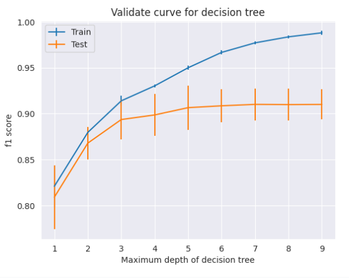

# IA : machine learning et deep learning

Le projet zoidberg est notre porte d'entrée dans l'apprentissage de l'IA.

En plus d'avoir suivi le FUN MOOC, nous avons pris le temps de faire le Bootsrap avec les données MNIST. Nous avons finalement traité les images de radios avec des modèles de machines learning et de réseaux de neurones.

## Le Bootsrap - MNIST

### Notre approche

Le but de ce projet est de réaliser un classifieur d'images de chiffres manuscrits. Pour cela, nous avons utilisé le dataset MNIST qui contient 70 000 images de chiffres manuscrits de 28x28 pixels.

Le dataset MNIST est très cadré, nous n'avons donc pas besoins de faire de prétraitements. 
L'analyse est déjà largement avancée puisque le dataset est homogène, nous prenons cependant le temps de regarder la distribution des chiffres, qui est assez bien équilibré.

Pour le bootstrap nous nous sommes concentrés sur le machine learning. On a testé plusieurs modèles de machine learning, avec différents hyperparamètres.

Une dernière partie très importante du travail est de comprendre et de mettre en place la validation croisée ainsi que les différentes metrics. 
Le bootsrap nous à permis de mieux comprendre les metrics et analyser les résultats, au travers notamment de la matrice de confusion.

Chaque étape est détaillée dans [le notebook MNIST](MNIST.ipynb), avec les résultats associés.

### Pour aller plus loin

Afin d'approfondir le Bootstrap et de le rendre plus ludique, nous avons également réalisé un model de prédiction interactif. 
Pour l'essayer il vous suffit de lancer [ce Notebook](MNIST_interactif.ipynb) en local après avoir installé les dépendances nécessaires.
```bash 
pip3 install numpy tensorflow scikit-learn tkinter
```
***attention*** : le model interactif prend environ 2 minute pour se charger. 
Il est entrainé sur des images de chiffre américain, il ne reconnait donc pas les nombres et échouera plus probablement 
si vous écrivez des chiffres français (pièges notables : écrire "7" avec une barre au milieu ou "9" avec une courbe en bas).

## Les radiographies - Zoidberg

### Analyse des données

Le dataset qui nous a été donné vient sans aucune explication, il est donc primordial de regarder plus en détail sa composition.

L'analyse des données nous montre plusieurs problèmes sur l'uniformisation des images ainsi que sur la distribution des classes. 
C'est pourquoi nous prévoyons plusieurs solutions de tri qui doivent nous permettre d'obtenir un dataset plus homogène.

Malheureusement, plusieurs essais confirmés par une learning curve nous on montré que la plus grosse faiblesse du dataset est sa petite taille, qui limite les performances des modèles.
Une politique de trie ne peut donc pas s'appliquer dans de telles conditions. C'est pourquoi par la suite, à partir du réseau de neuronnes, nous aurons recours à de l'augmentation de données.

Nos différents résultats et observations sur le prétaitement des données sont détaillés dans [le notebook Data Analisys](DEV_810_XRay_Data_analysis.ipynb).

### Machine learning

Les modèles de machines learning ne sont pas prévus et optimisés pour de l'analyse d'images. 
On ne trouve donc pas de documentation sur les meilleurs modèles à utiliser dans ce cadre-ci.

Pour cette raison, nous décidons de tester plusieurs modèles de machines learning afin de déterminer lequel est le plus adapté à notre dataset. Nous essayons notamment des modèles de types différents afin de rendre notre recherche plus exhaustive.
Nous testerons les modèles suivants :
- KNN (modèle prédiction par mémorisation, a contrario des modèles de généralisation)
- Decision Tree Classifier (arbre de décision)
- Random Forest (ensemble de plusieurs arbres de décision)
- Stochastic Gradient Descent (modèle de décision linéaire)

#### Méthodologie

La premiere étape de notre méthodologie est de décider ensemble des modèles que nous voulons tester, présentés plus haut.

Afin de comparer les modèles de manières significatives, nous n'avons comparé que des résultats issus de validation croisée. 
Pour trouver les meilleurs hyperparamètres, nous avons utilisé une recherche par grille.

Un exemple de recherche par grille pour plusieurs modèles est disponible dans [le notebook de grid search](grid_search_results.ipynb). **attention** ce Notebook met plusieurs heures pour être entièrement exécuté. Lors de nos recherches, nous avons lancé plusieurs Notebooks de ce type en parallèle, sur nos machines respectives.

Nous nous sommes servis de courbe de validation afin de déterminer les plages les plus intéressantes pour certains hyperparamètres.
C'est une étape très importante car elle permet de gagner du temps lors de la recherche par grille.

Voici un exemple de courbe de validation pour le paramètre `max_depth` du modèle Decision Tree :




### Réseaux de neurones


